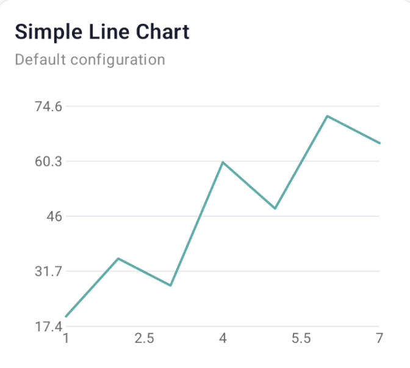
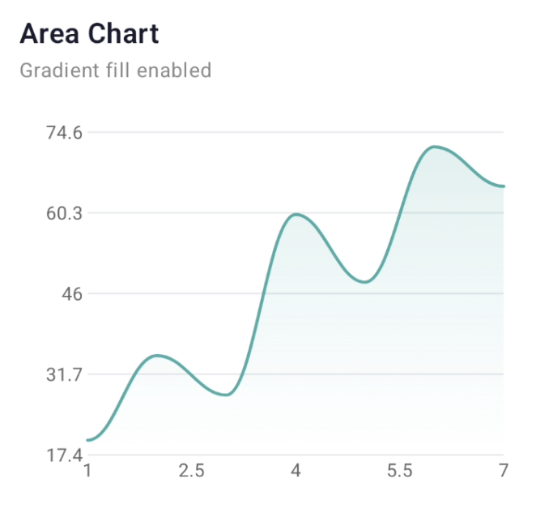
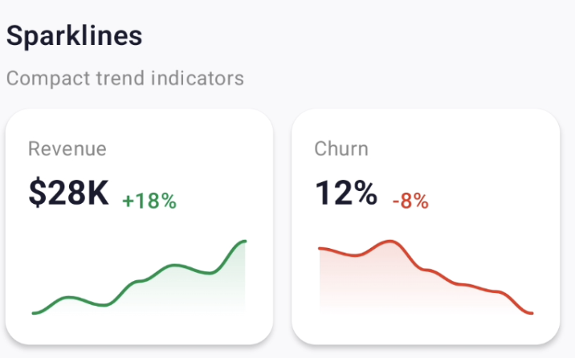
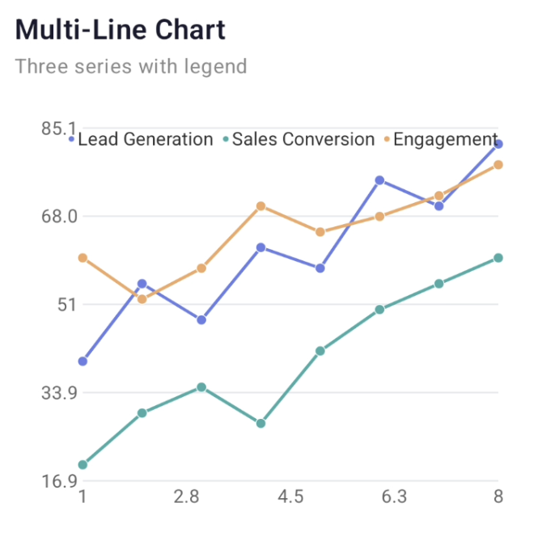
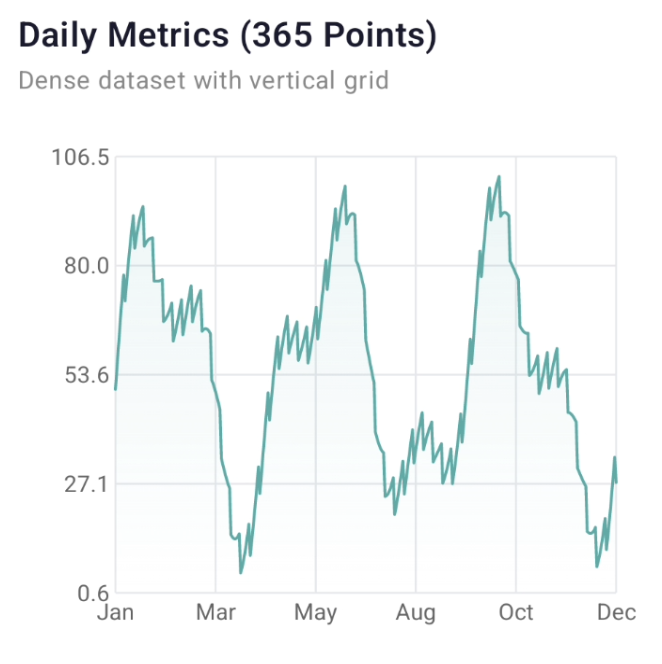

# CleanGraph

A lightweight, beautiful, clean graph library for Android Jetpack Compose.

**One Composable. Configuration objects. Beautiful defaults.**

## Screenshots

<p align="center">
  
  
  
</p>
<p align="center">
  
  
</p>

## Features

- 📈 **Line Chart** — straight or curved lines
- 🌊 **Area Chart** — soft gradient fill below the line
- ⚡ **Sparkline** — compact mini charts for cards and indicators
- 📊 **Multi-Line** — multiple series with auto-coloring and legend
- 🎯 **Tap Tooltip** — nearest-point detection with indicator line
- 🎨 **Trend Colors** — auto green/red based on data direction
- ✨ **Animation** — left-to-right reveal on first render
- 🔧 **Custom Formatters** — full control over axis labels and tooltips
- 🛡️ **Safe** — handles empty data, NaN, Infinity, single points, etc.
- 📦 **Zero dependencies** — pure Compose Canvas, no external chart libraries

## Installation

### JitPack

Add JitPack to your project-level `settings.gradle.kts`:

```kotlin
dependencyResolutionManagement {
    repositories {
        google()
        mavenCentral()
        maven { url = uri("https://jitpack.io") }
    }
}
```

Add the dependency to your module-level `build.gradle.kts`:

```kotlin
dependencies {
    implementation("com.github.user:CleanGraph:1.0.0")
}
```

### Local Module

If using as a local module:

```kotlin
// settings.gradle.kts
include(":linegraph")

// app/build.gradle.kts
dependencies {
    implementation(project(":linegraph"))
}
```

## Quick Start

```kotlin
import com.guy.linegraph.CleanGraph
import com.guy.linegraph.model.GraphPoint

val points = listOf(
    GraphPoint(1f, 20f, "Jan"),
    GraphPoint(2f, 35f, "Feb"),
    GraphPoint(3f, 28f, "Mar"),
    GraphPoint(4f, 60f, "Apr")
)

CleanGraph(
    points = points,
    modifier = Modifier
        .fillMaxWidth()
        .height(240.dp)
)
```

That's it. No configuration needed for a clean default chart.

<p align="center">
  
</p>

## Usage Examples

### Area Chart

Enable gradient fill with curved lines for a smooth, polished look.

<p align="center">
  
</p>

```kotlin
CleanGraph(
    points = points,
    modifier = Modifier.fillMaxWidth().height(260.dp),
    config = CleanGraphConfig(
        area = AreaConfig(visible = true),
        line = LineConfig(curved = true)
    )
)
```

### Sparkline

Compact mini charts ideal for dashboard cards. Auto trend coloring turns the line green for positive trends and red for negative.

<p align="center">
  
</p>

```kotlin
CleanGraph(
    points = points,
    modifier = Modifier.width(160.dp).height(70.dp),
    config = CleanGraphConfig(
        mode = GraphMode.Sparkline,
        line = LineConfig(autoTrendColor = true, curved = true),
        area = AreaConfig(visible = true),
        contentPadding = PaddingValues(4.dp)
    )
)
```

### Multi-Line Chart

Plot multiple series with automatic legend and data point markers.

<p align="center">
  
</p>

```kotlin
CleanGraph(
    series = listOf(
        GraphSeries("Lead Gen", leadPoints, Color(0xFF6C7AE0)),
        GraphSeries("Sales", salesPoints, Color(0xFF4DB6A4)),
        GraphSeries("Engagement", engagementPoints, Color(0xFFE9A66B))
    ),
    modifier = Modifier.fillMaxWidth().height(280.dp),
    config = CleanGraphConfig(
        legend = LegendConfig(visible = true),
        line = LineConfig(showPoints = true)
    )
)
```

### Dense Data (365+ points)

Handles large datasets smoothly. Great for daily metrics over a full year.

<p align="center">
  
</p>

```kotlin
val dailyMetrics = (0 until 365).map { i ->
    GraphPoint(
        x = i.toFloat(),
        y = 50f + 30f * sin(i * 0.05f) + 15f * sin(i * 0.12f)
    )
}

CleanGraph(
    points = dailyMetrics,
    modifier = Modifier.fillMaxWidth().height(280.dp),
    config = CleanGraphConfig(
        area = AreaConfig(visible = true, alpha = 0.12f),
        line = LineConfig(width = 1.5.dp, defaultColor = Color(0xFF6C7AE0)),
        xAxis = AxisConfig(
            labelCount = 6,
            formatter = { v ->
                val month = (v / 30).toInt().coerceIn(0, 11)
                listOf("Jan","Feb","Mar","Apr","May","Jun",
                       "Jul","Aug","Sep","Oct","Nov","Dec")[month]
            }
        ),
        grid = GridConfig(horizontalLines = true, verticalLines = true)
    )
)
```

### Custom Axis Formatting

Full control over how axis labels and tooltips display values.

```kotlin
CleanGraph(
    points = revenuePoints,
    modifier = Modifier.fillMaxWidth().height(280.dp),
    config = CleanGraphConfig(
        area = AreaConfig(visible = true),
        xAxis = AxisConfig(
            formatter = { v ->
                when (v.toInt()) {
                    1 -> "Jan"; 2 -> "Feb"; 3 -> "Mar"
                    4 -> "Apr"; 5 -> "May"; 6 -> "Jun"
                    else -> ""
                }
            }
        ),
        yAxis = AxisConfig(
            formatter = { v -> "$${v.toInt()}M" }
        ),
        tooltip = TooltipConfig(
            formatter = { _, point ->
                "${point.label ?: ""}\nRevenue: $${point.y.toInt()}M"
            }
        )
    )
)
```

## API Reference

### Public Composable

Only **one** public Composable:

```kotlin
@Composable
fun CleanGraph(
    series: List<GraphSeries>,
    modifier: Modifier = Modifier,
    config: CleanGraphConfig = CleanGraphConfig()
)

// Convenience overload for single-series usage
@Composable
fun CleanGraph(
    points: List<GraphPoint>,
    modifier: Modifier = Modifier,
    config: CleanGraphConfig = CleanGraphConfig()
)
```

### Data Models

| Class | Description |
|-------|-------------|
| `GraphPoint(x, y, label?, metadata?)` | A single data point |
| `GraphSeries(name, points, color?)` | A named series of points |

### Configuration

| Config | Key Properties |
|--------|----------------|
| `CleanGraphConfig` | `mode`, `line`, `area`, `xAxis`, `yAxis`, `grid`, `tooltip`, `legend`, `contentPadding`, `animationEnabled` |
| `LineConfig` | `visible`, `width`, `curved`, `showPoints`, `pointRadius`, `defaultColor`, `autoTrendColor`, `positiveColor`, `negativeColor` |
| `AreaConfig` | `visible`, `alpha`, `gradientHeightRatio` |
| `AxisConfig` | `visible`, `labelCount`, `labelColor`, `labelTextSize`, `formatter` |
| `GridConfig` | `visible`, `lineColor`, `lineWidth`, `horizontalLines`, `verticalLines` |
| `TooltipConfig` | `enabled`, `backgroundColor`, `textColor`, `textSize`, `cornerRadius`, `formatter` |
| `LegendConfig` | `visible`, `position`, `textColor`, `textSize` |

### GraphMode

| Mode | Behavior |
|------|----------|
| `GraphMode.Chart` | Full chart with axes, grid, tooltip, legend |
| `GraphMode.Sparkline` | Mini chart — hides axes, grid, legend, tooltip by default |

## Project Structure

```
linegraph/src/main/java/com/guy/linegraph/
├── CleanGraph.kt              ← Public API
├── CleanGraphPreview.kt       ← Compose previews
├── model/
│   ├── GraphPoint.kt
│   ├── GraphSeries.kt
│   └── GraphTrend.kt
├── config/
│   ├── CleanGraphConfig.kt
│   ├── GraphMode.kt
│   ├── LineConfig.kt
│   ├── AreaConfig.kt
│   ├── AxisConfig.kt
│   ├── GridConfig.kt
│   ├── TooltipConfig.kt
│   └── LegendConfig.kt
└── internal/                  ← Not public API
    ├── GraphScaler.kt
    ├── GraphPathBuilder.kt
    ├── GraphRenderer.kt
    ├── AxisRenderer.kt
    ├── GridRenderer.kt
    ├── TooltipRenderer.kt
    └── PointSelector.kt
```

## Edge Cases Handled

- Empty series / empty points → renders nothing (no crash)
- Single point → renders centered dot
- All X values equal → renders vertical line of points
- All Y values equal → renders horizontal line
- NaN / Infinity values → filtered out automatically
- Negative Y values → fully supported
- Very large values → auto-scaled
- Multiple series with different X ranges → unified axis

## Requirements

- Android API 28+
- Jetpack Compose (BOM 2024+)
- Kotlin 2.0+

## License

```
MIT License

Copyright (c) 2025

Permission is hereby granted, free of charge, to any person obtaining a copy
of this software and associated documentation files (the "Software"), to deal
in the Software without restriction, including without limitation the rights
to use, copy, modify, merge, publish, distribute, sublicense, and/or sell
copies of the Software, and to permit persons to whom the Software is
furnished to do so, subject to the following conditions:

The above copyright notice and this permission notice shall be included in all
copies or substantial portions of the Software.

THE SOFTWARE IS PROVIDED "AS IS", WITHOUT WARRANTY OF ANY KIND, EXPRESS OR
IMPLIED, INCLUDING BUT NOT LIMITED TO THE WARRANTIES OF MERCHANTABILITY,
FITNESS FOR A PARTICULAR PURPOSE AND NONINFRINGEMENT. IN NO EVENT SHALL THE
AUTHORS OR COPYRIGHT HOLDERS BE LIABLE FOR ANY CLAIM, DAMAGES OR OTHER
LIABILITY, WHETHER IN AN ACTION OF CONTRACT, TORT OR OTHERWISE, ARISING FROM,
OUT OF OR IN CONNECTION WITH THE SOFTWARE OR THE USE OR OTHER DEALINGS IN THE
SOFTWARE.
```
